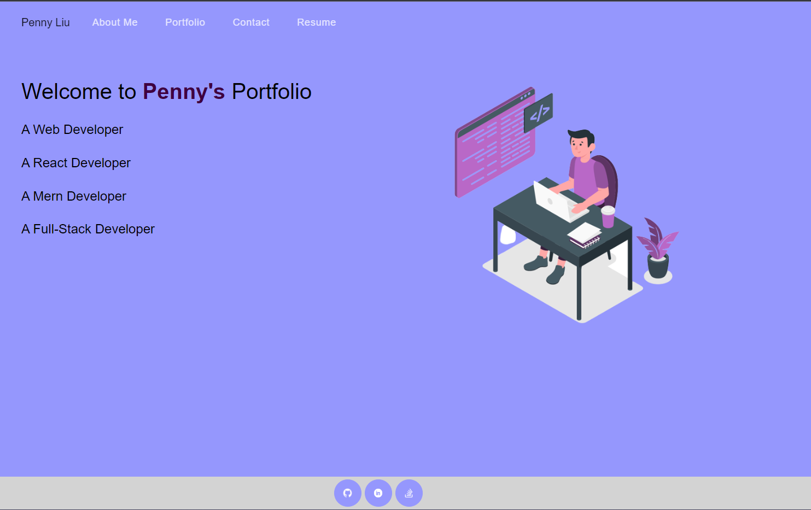
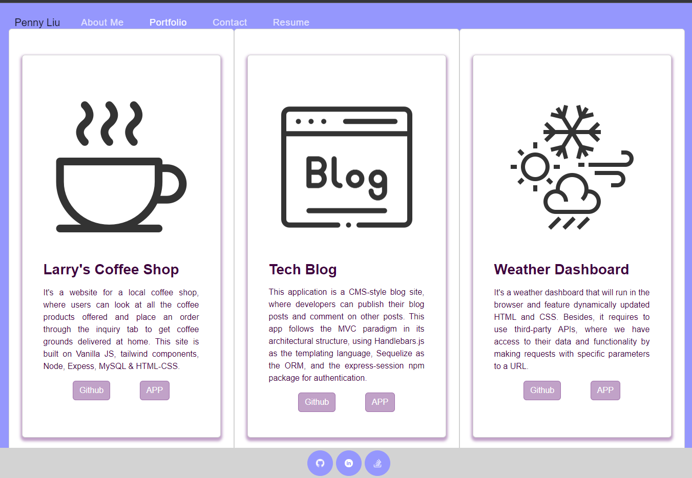
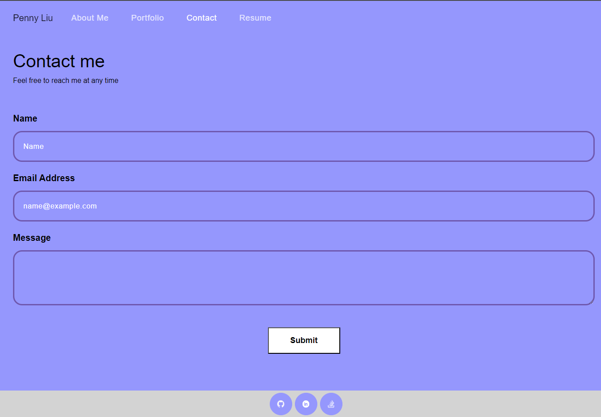

# My React Portfolio

## Description
This application is a portfolio using react. It has four pages, 'About Me', 'Prorfolio', 'Contact' and 'Resume'.

## Table of Contents
  * [User Story](#user-story)
  * [Installation](#installation)
  * [Heroku Link](#heroku-link)
  * [Application Screenshot](#application-screenshot)
  * [Questions](#questions)  

## User Story
```md
AS AN employer looking for candidates with experience building single-page applications
I WANT to view a potential employee's deployed React portfolio of work samples
SO THAT I can assess whether they're a good candidate for an open position
```

## Installation
- Install required node pacakges by running:
    ```
    npm i
    ```

## Heroku Link
This application is deployed to [Heroku](https://penny-react-portfolio.herokuapp.com/)

## Application Screenshot
- WHEN I load the portfolio, THEN I am presented with a page containing a header, a section for content, and a footer. </br>
- WHEN I view the header, THEN I am presented with the developer's name and navigation with titles corresponding to different sections of the portfolio. </br>
- WHEN I view the navigation titles, THEN I am presented with the titles About Me, Portfolio, Contact, and Resume, and the title corresponding to the current section is highlighted. </br>
- WHEN I click on a navigation title, THEN I am presented with the corresponding section below the navigation without the page reloading and that title is highlighted. </br>
- WHEN I load the portfolio the first time, THEN the About Me title and section are selected by default. </br>


- WHEN I am presented with the Portfolio section, THEN I see titled images of six of the developer’s applications with links to both the deployed applications and the corresponding GitHub repository. </br>


- WHEN I am presented with the Contact section, THEN I see a contact form with fields for a name, an email address, and a message.</br>


## Questions
If you have any questions, you can find [my Github](https://github.com/PennyLIU2022) and reach me by email at: pennyliu806@gmail.com